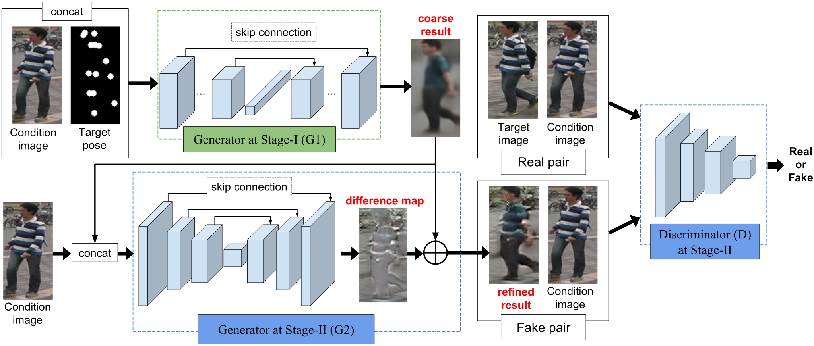

# PoseFaceGAN
Reference: Tensorflow implementation of NIPS 2017 paper  <b>  [Pose Guided Person Image Generation](https://papers.nips.cc/paper/6644-pose-guided-person-image-generation.pdf) </b>

## Network architecture Ref


## Dependencies
- python 2.7 
- tensorflow-gpu (1.4.1)
- numpy (1.14.0)
- Pillow (5.0.0)
- scikit-image (0.13.0)
- scipy (1.0.1)
- matplotlib (2.0.0)

## Resources
 - None as now
 
## TF-record data preparation steps
 You can skip this data preparation procedure if directly using the tf-record data files.
 1. `cd datasets`
 2. `./run_convert_market.sh` to download and convert the original images, poses, attributes, segmentations
 3. `./run_convert_DF.sh` to download and convert the original images, poses

 Note: we also provide the convert code for [Market-1501 Attribute](https://github.com/vana77/Market-1501_Attribute) and Market-1501 Segmentation results from [PSPNet](https://github.com/hszhao/PSPNet). These extra info. are provided for further research. In our experiments, pose mask are ontained from pose key-points (see `_getPoseMask` function in convert .py files).

## Training steps
 1. Download the tf-record training data.
 2. Modify the `model_dir` in the run_market_train.sh/run_DF_train.sh scripts.
 3. run run_market_train.sh/run_DF_train.sh 
 
 Note: we use a triplet instead of pair real/fake for adversarial training to keep training more stable.

## Testing steps
 1. Download the pretrained models and tf-record testing data.
 2. Modify the `model_dir` in the run_market_test.sh/run_DF_test.sh scripts.
 3. run run_market_test.sh/run_DF_test.sh 

## Citation
```
@inproceedings{ma2017pose,
  title={Pose guided person image generation},
  author={Ma, Liqian and Jia, Xu and Sun, Qianru and Schiele, Bernt and Tuytelaars, Tinne and Van Gool, Luc},
  booktitle={Advances in Neural Information Processing Systems},
  pages={405--415},
  year={2017}
}
```